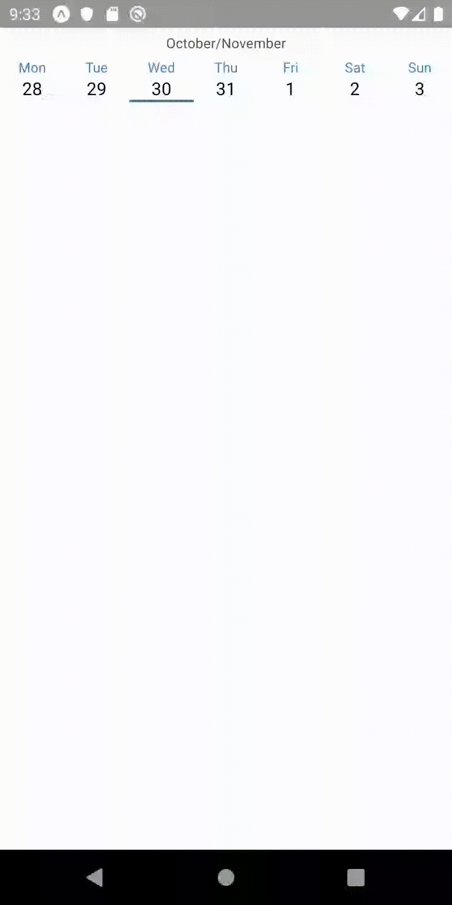

# swipeable-calendar-strip-react-native --- in development

React Native library - Swipeable Calendar Strip 

</img>

## Installation

Use npm package manager to install.

```bash
npm install swipeable-calendar-strip-react-native
```

## Usage

```javascript
import CalendarStrip from "swipeable-calendar-strip-react-native";
import moment from "moment";

const calendar = props => {
   return (
      <CalendarStrip 
        dayPressed={(day) => console.log(day)} //executes when day is pressed -- required
        showHeader={true} //accepts booleans 
        startingDate={moment()} //accepts Date or moment date format -- initial value = moment()
      />
   )
}

export default calendar;
```

## Contributing
Pull requests are welcome. For major changes, please open an issue first to discuss what you would like to change.

Please make sure to update tests as appropriate.

## License
Licenced under MIT licence
